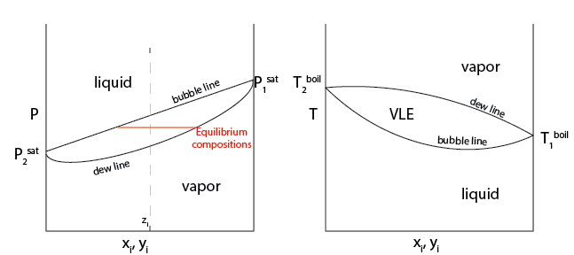
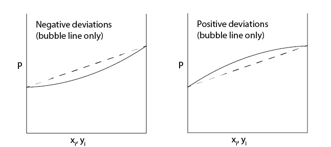
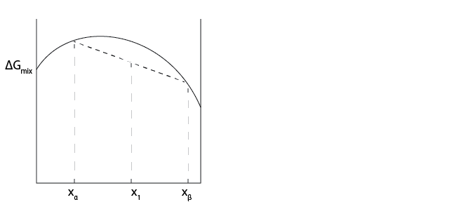
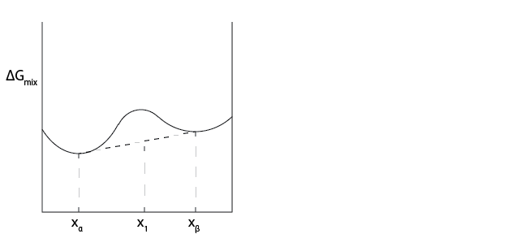
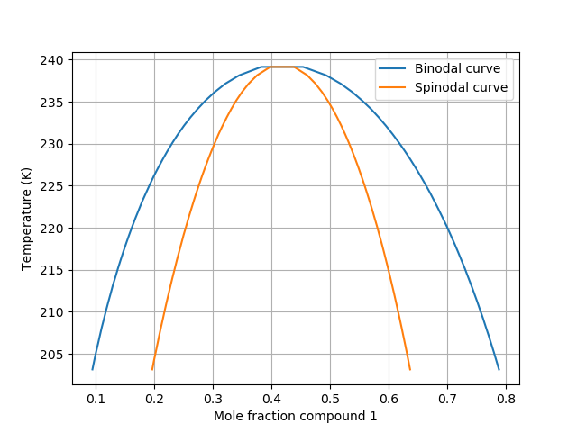

# Non-ideal mixtures

## Additional Readings for the Enthusiast

{cite:ts}`tester_thermodynamics_1997`, Ch. 9.8, 15.3

## Goals for Today's Lecture
- Define and derive Raoult's Law for vapor-liquid equilibrium
- Read binary phase diagrams; define equilibrium compositions
- Describe how non-ideality causes deviations from Raoult's Law; modify Raoult's Law for non-ideal mixtures
- Plot and understand Gibb's free energy of mixing ($\Delta G_{mix}$) in liquid mixtures
- From plots of $\Delta G_{mix}$, identify when phase separation and mixing occurs


## Raoult's Law

In the last lecture, we defined two simplified approximations for
mixtures: an {term}`ideal-gas mixture` and an {term}`ideal solution`. An ideal
solution is a solution in which the intermolecular interactions between
system constituents are sufficiently similar that the interactions
between different components are equivalent to the interactions between
pure components with themselves. An ideal-gas mixture further
approximates all components as ideal gases. For these systems, we
derived the Lewis-Randall rule for the fugacities as:

$$\begin{aligned}
\hat{f}_i^\textrm{IS} &= x_i f_i \\
\hat{f}_i^\textrm{IG} &= y_i P
\end{aligned}$$

Where $\hat{f}$ denotes the fugacity of a component in a mixture, and $f_i$
is the single-phase fugacity.

We can use these expressions to derive an expression for phase
equilibrium between a vapor phase and a liquid phase, in which we assume
the vapor phase is an ideal-gas mixture and the liquid phase is an ideal
solution. Phase equilibrium between these completely ideal phases thus
represents an extreme of behavior and we will then consider deviations
from ideality.

First, recall that the condition for phase equilibrium in multicomponent
systems is:

$$\begin{aligned}
\hat{f}_i^\textrm{vap} &= \hat{f}_i^\textrm{liq}
\end{aligned}$$

This expression has to hold for each component of our mixture. Treating
the vapor phase as an ideal-gas mixture and the liquid phase as an ideal
solution gives:

$$\begin{aligned}
\hat{f}_i^\textrm{IG} &= y_i P \\
\hat{f}_i^\textrm{IS} &= x_i f_i \\
\therefore x_i f_i^\textrm{liq} &= y_i P
\end{aligned}$$

We previously derived the [Poynting correction](https://en.wikipedia.org/wiki/Poynting_effect) as an approximation for
the fugacity of a liquid-phase component, given by:

$$\begin{aligned}
f_i^{\textrm{liq}} = f_i^{\textrm{sat}} \exp\left [ \frac{V_i^{\textrm{liq}}(P-P_i^{\textrm{sat}})}{RT} \right ]
\end{aligned}$$

At vapor-liquid equilibrium, the fugacity of pure component $i$ in the
liquid phase is equal to the fugacity of pure component $i$ in the vapor
phase. Since the vapor phase of the mixture is an ideal-gas mixture,
pure component $i$ in the vapor phase is also an ideal gas. Therefore we
have:

$$\begin{aligned}
f_i^\textrm{sat} &= f_i^\textrm{vap, sat} = P_i^\textrm{sat} \\
f_i^{\textrm{liq}} &= P_i^\textrm{sat}  \exp\left [ \frac{V_i^{\textrm{liq}}(P-P_i^{\textrm{sat}})}{RT} \right ]
\end{aligned}$$

Typically, the exponential term is negligible unless the pressure
significantly varies from the saturation pressure, so we can approximate
the fugacity of the ideal solution as:

$$\begin{aligned}
f_i^\textrm{liq} &\approx P_i^\textrm{sat}
\end{aligned}$$

The notation emphasizes that the fugacity of component $i$ in the liquid
phase is equal to the saturation pressure of that pure component.
Combining with the condition of phase equilibrium leads to

```{glossary}
[Raoult's Law](https://en.wikipedia.org/wiki/Raoult%27s_law)

    $$\begin{aligned}
    x_i f_i^\textrm{liq} &= y_i P \\
    \therefore x_i P_i^\textrm{sat} &= y_i P
    \end{aligned}$$
```

Raoult's law states that the partial pressure of component $i$ in the
vapor phase ($y_i P$) at equilibrium with a liquid solution is related
to the saturation pressure of pure component $i$ weighted by its mole
fraction in the liquid solution. Since mole fractions have to sum to 1,
we can also then write:

$$\begin{aligned}
\sum_i^n x_i P_i^{\textrm{sat}} = \sum_i^n y_i P = P
\end{aligned}$$

## Binary phase diagrams

We can plot the equilibrium conditions predicted by Raoult's Law for a
two-component system by drawing a **binary phase diagram**.
In a binary phase diagram, 
- the y-axis is typically the pressure (in which case the temperature is constant for the entire phase diagram)
- or temperature (in which case the pressure is held constant for the entire phase diagram)
- the x-axis represents composition in terms of mole fraction

Such diagrams are called **P-x-y** or **T-x-y** diagrams respectively, with
the $x$ and $y$ referring to the fact that the composition axis can
refer to both composition in vapor and liquid phases. Each phase diagram
represents a slice through a higher-dimensional $PVT$ space.



Consider an example P-x-y diagram for a system described well by
Raoult's Law. The overall mole fraction of the mixture is denoted as
$z_i$. At a high pressure, a single liquid phase is observed and
$x_i = z_i$ in this phase. At a low pressure, a single vapor phase is
observed and $y_i = z_i$ in this phase. For intermediate pressures,
there is a region of the phase diagram in which we would observe

```{glossary}
vapor-liquid equilibrium
    also known as VLE. Region of phase space where vapor and liquid
    are both stable
```

If we were to imagine compressing
an initially vapor system with composition $z_i$ infinitely slowly, the
pressure at which we first observe a drop of liquid is called the {term}`dew
point`, which corresponds to the first pressure for which the
conditions of VLE are satisfied. Recall that these conditions are:

$$\begin{aligned}
\hat{f}_i^\textrm{liq} &= \hat{f}_i^\textrm{vap} 
\end{aligned}$$

```{glossary}
dew line
    The locus of dew points for all possible system compositions, and
    represents the lower (on a P-x-y diagram) or upper (on
    a T-x-y diagram) bound of the phase envelope (or binodal) encapsulating
    the region of VLE.
```

Similarly, we could imagine expanding an initially
liquid system until we first observe a vapor bubble, leading to the

```{glossary}
bubble point
    the pressure at which we first observe a vapor bubble
```

```{glossary}
bubble line
    the locus of all bubble points
```

```{admonition} What is the composition of each of the phases in the VLE phase envelope?
<details><summary>Click for answer</summary>

In the VLE phase envelope, the composition of the vapor phase at
any given pressure and temperature is equal to the composition of the
corresponding point on the dew line (*i.e.*, at the same pressure and
temperature) while the composition of the liquid phase is equal to the
composition of the corresponding point on the bubble line. Equivalently,
we can imagine drawing a horizontal line connecting the bubble and dew
lines - called a tie line - and the intersections of the tie line with
the bubble and dew lines defines the compositions of the phases present
at equilibrium. Since these compositions are determined only by the
temperature and pressure, the overall composition of the system ($z_i$)
only changes the relative amounts of the two phases present in the
system. This behavior is analogous to how the total volume of a
single-component system at the saturation pressure changes only the
relative amounts of the two phases present.
</details>
```

## VLE for non-ideal systems

Raoult's Law defines the simplest possible phase behavior in a binary
system since we assume ideality for both phases. Raoult's Law gives rise
to a linear bubble line on P-x-y plots; this can be shown by applying
the mass balance constraint to Raoult's Law:

$$\begin{aligned}
x_i P_i^\textrm{sat} &= y_i P \\
\sum_i y_i P &= P = \sum_i x_i P_i^\textrm{sat} \\
\therefore P &= x_1 P_1^\textrm{sat} + (1-x_1) P_2^\textrm{sat} \\
&= P_2^\textrm{sat} + x_1 (P_1^\textrm{sat} - P_2^\textrm{sat})
\end{aligned}$$

Ideal behavior is thus easy to see from P-x-y plots, as deviations from
ideality will give rise to non-linear bubble lines. 



- Solutions that have pressures larger than expected from Raoult's Law are said to exhibit *positive* deviations, so that $P > \sum_i^n x_i P_i^{\textrm{sat}}$. Positive deviations indicate a shift in the equilibrium toward the vapor phase (i.e., the fugacities of components in the liquid phase are higher than expected of an ideal solution, driving material to the vapor phase), suggesting that the intermolecular forces acting between the different components in the liquid phase are not ideal, but instead are repulsive relative to the pure components.
- In contrast, solutions that have vapor pressures smaller than expected from Raoult's Law are said to exhibit *negative* deviations, indicating that intermolecular interactions in the liquid phase are attractive relative to the pure components.

We can predict VLE behavior by calculating fugacities from
tabulated compressibility factors or analytical equations of state using
the framework previously developed without assuming that the liquid and
vapor phases are ideal; we will not go into further details on these
approaches.

## Activity and modified Raoult's Law

Since the entropy of mixing is always favorable,
any system that exhibits deviations from ideality
must have an enthalpy of mixing that is non-zero and
thus cannot be approximated as an ideal solution. While we can treat any
non-idealities through fugacity calculations for the liquid phase, these
approaches tend to be quantitatively inaccurate since they are typically
derived to model both the properties of the vapor and liquid phase. An
alternative approach is to consider the deviation of the real solution
behavior from the behavior of an ideal solution, in much the same way as
the fugacity considers the deviation of a mixture's behavior from that
of an ideal-gas mixture. We will quantify such deviations by defining
the **excess properties** of a solution.

```{glossary}
excess property
    the difference between the property of a real solution and same
    property for an ideal solution at the same temperature, pressure, and
    composition; hence, it is similar to a departure function, but uses an
    ideal solution reference state rather than an ideal gas reference state.
```

For some property $B$, we can write the excess property as:

$$\begin{aligned}
\underline{B}^E &= \underline{B} - \underline{B}^{\textrm{IS}} \\
B^E &= B - B^{\textrm{IS}}
\end{aligned}$$

Here, $\underline{B}$ (or $B$ in intensive form) is a property of an
entire mixture and $\underline{B}^E$ is the corresponding excess
property. We can further relate these properties to corresponding
property changes upon mixing by subtracting an identical pure-component
reference state from each term in the definition of the excess property:

$$\begin{aligned}
B^E &= (B - \sum_i x_i B_i) - (B^\textrm{IS} - \sum_i x_i B_i) \\
&= \Delta B_\textrm{mix} - \Delta B_\textrm{mix}^\textrm{IS}
\end{aligned}$$

To quantify deviations in real solution behavior at phase equilibrium,
we want to consider the behavior of the excess Gibbs free energy, which
we can write in intensive form as:

$$\begin{aligned}
G^E &= G - G^\textrm{IS} = \Delta G_\textrm{mix} - \Delta G_\textrm{mix}^\textrm{IS}
\end{aligned}$$

```{admonition} Show that $G^E = RT \sum_i x_i \ln \frac{\hat{f}_i}{\hat{f}_i^\textrm{IS}}$
<details><summary>Click for answer</summary>

Recalling our expressions for the Gibbs free energy of mixing and the
Gibbs free energy of mixing for an ideal solution from the last lecture,
we can then write:

$$\begin{aligned}
G^E &= \Delta G_\textrm{mix} - \Delta G_\textrm{mix}^\textrm{IS} \\
&= \sum_i x_i ( \overline{G}_i - G_i) - RT \sum_i x_i \ln x_i 
\end{aligned}$$

Finally, in the last lecture we also showed that we can relate the
difference in the partial molar Gibbs free energy of component $i$ and
the molar Gibbs free energy of pure $i$ to the difference between the
fugacity of component $i$ in a mixture and the fugacity of pure $i$,
yielding:

$$\begin{aligned}
G^E &= \sum_i x_i ( \overline{G}_i - G_i) - RT \sum_i x_i \ln x_i \\
&= RT \sum_i x_i  \ln \frac{\hat{f}_i}{f_i} - RT \sum_i x_i \ln x_i \\
&= RT \sum_i x_i \ln \frac{\hat{f}_i}{x_i f_i} \\
\therefore G^E &= RT \sum_i x_i \ln \frac{\hat{f}_i}{\hat{f}_i^\textrm{IS}}
\end{aligned}$$
</details>

This last line follows because $x_i f_i$ is the fugacity of a component
in an ideal solution, so we again find that the excess Gibbs free energy
measures deviations from ideal solution behavior rather than ideal-gas
mixture behavior.

```

Excess properties are associated with the property of an entire
single-phase mixture, but in the prior approach to calculating
fugacities for mixtures we associated a fugacity and fugacity
coefficient with each component of the mixture, and emphasized that
these values were composition dependent. Similarly, we will now define a
component-specific and composition-dependent quantity called the

```{glossary}
activity

    $$\begin{aligned}
    a_i \equiv \frac{\hat{f}_i}{f_i}
    \end{aligned}$$
```

Similarly, we can define the

```{glossary}
activity coefficient

    $$\begin{aligned}
    \gamma_i &= \frac{a_i}{x_i} = \frac{\hat{f}_i}{x_i f_i}
    \end{aligned}$$
```

The activity measures the ratio between the fugacity of component $i$ in
a mixture and the fugacity of pure component $i$, while the activity
coefficient measures the deviation of the fugacity of component $i$ in a
mixture from component $i$ in an ideal solution. The activity
coefficient is conceptually similar to the fugacity coefficient, except
the deviation is relative to ideal solution behavior rather than
relative to ideal gas behavior.

For an ideal solution,
$\gamma_i = 1$, just as for an ideal gas $\phi_i = 1$. Importantly, the
activity and activity coefficient are only calculated for **condensed
phases**, meaning liquid and solid phases; this is because vapor phases
will typically behave as ideal solutions. The excess Gibbs free energy
can be written in terms of the activity coefficient as:

$$\begin{aligned}
G^E &= RT \sum_i x_i \ln \gamma_i
\end{aligned}$$

Similarly, since we know that any extensive property of a mixture can be
written as a sum of partial molar properties, we can also write:

$$\begin{aligned}
G^E &= \sum_i x_i \overline{G}_i^E \\
\therefore \overline{G}_i^E &= \left( \frac{\partial \underline{G}^E}{\partial N_i} \right)_{T,P,N_j,[N_i]} = RT \ln \gamma_i 
\end{aligned}$$

The partial molar excess Gibbs free energy of component $i$ is thus
equal to the log of the activity coefficient. In other words, **the
activity coefficient is a measure of how much the addition of component
$i$ to a single-phase mixture increases the Gibbs free energy in excess
of what would be expected for an ideal solution.**

```{admonition} What will $\gamma_i$ be when component $i$ interactions via repulsive interactions?
<details><summary>Click for answer</summary>

$\gamma_i>1$, increasing the Gibbs free energy
</details>
```

```{admonition} What will $\gamma_i$ be when component $i$ interactions via attractive interactions?
<details><summary>Click for answer</summary>

$\gamma_i<1$, decreasing the Gibbs free energy
</details>
```

Finally, we can relate the activity back to phase equilibrium by simply
rewriting the definition of the activity coefficient to obtain:

$$\begin{aligned}
\hat{f}_i &= x_i \gamma_i f_i 
\end{aligned}$$

This expression can then be used for any condensed phase and is
particularly valuable if that condensed phase does not behave as an
ideal solution. For example, using this expression for the liquid-phase
fugacity while still assuming the vapor phase behaves nearly ideally
leads to **modified Raoult's Law** for VLE following a similar
derivation as above:

$$\begin{aligned}
y_i P &= x_i \gamma_i P_i^\textrm{sat} 
\end{aligned}$$

In practice, the value of expressions using the activity or activity
coefficient, rather than the fugacity, is that it allows us to derive
activity models that only have to be accurate for the liquid phase,
whereas fugacity calculations based on equations of state or
compressibility factors require data that are accurate for multiple
phases. Several empirical approaches exist for calculating activity
coefficients, including techniques based on fitting empirical data
(*e.g.*, the one- and two-parameter [Margules models](https://en.wikipedia.org/wiki/Margules_activity_model),
the [van Laar model](https://en.wikipedia.org/wiki/Van_Laar_equation#:~:text=The%20Van%20Laar%20equation%20is,the%20Van%20der%20Waals%20equation.),
and the [NRTL model](https://en.wikipedia.org/wiki/Non-random_two-liquid_model)) and predictive models based on molecular properties
(*e.g.,* the Scatchard-Hildebrand model and UNIFAC). These techniques
are out of the scope of this class but can be used to compute activity
coefficients and thus determine conditions of phase equilibrium using
the framework that we have just developed.

## Gibbs free energy of mixing at LLE

Let us now consider systems that exhibit phase separation into multiple
liquid phases, such as oil-water mixtures. Our thermodynamic framework
is unchanged - our conditions of liquid-liquid equilibrium (LLE) are
still:

$$\begin{aligned}
\hat{f}_i^\alpha &= \hat{f}_i^\beta \\
x_i^\alpha \gamma_i^\alpha &= x_i^\beta \gamma_i^\beta
\end{aligned}$$

We use $\alpha$ and $\beta$ to refer to the compositions of two distinct
liquid phases, with the second line following from the definition of the
activity in the preceding section. We can understand why LLE arises by
considering the thermodynamics of mixing as introduced in the preceding
lecture. We will first introduce the [lever rule](https://en.wikipedia.org/wiki/Lever_rule)
which generalizes the concept of a

```{glossary}
tie line
    a line drawn on a thermodynamic diagram to relate the properties of a
    system to those at the end points of the diagram
```

An example from [Wikipedia](https://en.wikipedia.org/wiki/Lever_rule) is below:


If we consider a
plot of the Gibbs free energy of mixing as a function of the mole
fraction of component 1, a tie line can be drawn between any two points
on this line as long as one point corresponds to a mole fraction of
component 1 that is less than the overall mixture composition and one
point corresponds to a mole fraction of component 1 that is greater than
the overall mixture composition. Notationally, let us define one phase
with a composition at an end point of a tie line as $\alpha$ and another
phase with a composition at an end point of a tie line as $\beta$, with
the compositions defined such that $x_1^\alpha < x_1 < x_1^\beta$, where
$x_1$ is the overall composition of the system.


We will define the
amount of material in phase $\beta$ as $L^\beta$ and the total amount of
material in the system as $F$. We can then write two important tie lines
relationships that have graphical interpretations as:

$$\begin{aligned}
\frac{L^\beta}{F} &= \frac{x_1 - x_1^\alpha}{x_1^\beta - x_1^\alpha} \\
\Delta G_\textrm{mix} &= \Delta G_\textrm{mix}^\alpha + \frac{\Delta G_\textrm{mix}^\beta - \Delta G_\textrm{mix}^\alpha}{x_1^\beta - x_1^\alpha} \left ( x_1 - x_1^\alpha \right )
\end{aligned}$$

The first relationship follows from a mass balance and shows that the
amount of material in each phase can be related to the ratio of the line
segment from one phase composition to the overall mass fraction
normalized by the line segment connecting the two end points; this
relationship is called the **lever rule** and can be applied to any tie
line (including tie lines drawn on binary phase diagrams). The second
relationship simply expresses the total Gibbs free energy of mixing of a
system that separates into two phases as the weighted average of the
Gibbs free energy of mixing of each phase (given by the end points of
the tie line) and can be interpreted as the equation for the segment of
the tie line connecting $x_\alpha$ and $x_1$. This relationship thus
shows that graphically the intersection of the tie line with the overall
mixture composition gives the total Gibbs free energy change of the
system if the system were to split into two phases with compositions set
by the end points of the tie line.

Using the {term}`tie line` concept, we can then relate phase compositions to the
Gibbs free energy of mixing, building upon concepts in previous
lectures.


```{admonition} If we had a phase diagram like that in our figure above, would we expect a single mixed phase or two phases of $\alpha$ and $\beta$ to be present at $x_1$?
<details><summary>Click for answer</summary>

The single, mixed phase (on the curve) has a lower $\Delta G_{mix}$,
so we would see a single, mixed phase.

</details>
```

Let's consider two other cases:

Case 1:



```{admonition} In Case 1, would we expect a single mixed phase or two phases of $\alpha$ and $\beta$ to be present at $x_1$?
<details><summary>Click for answer</summary>

The single, mixed phase (on the curve) has a higher $\Delta G_{mix}$,
so we would see complete phase separation, or demixing. We can infer
the amount of each pure system from the tie line. 

</details>
```

Case 2: 
We can now consider the more complicated case where the free energy of
mixing has multiple local minima.



For these plots, there are choices for $x_{\alpha}$ and $x_{\beta}$
where any possible tie line will lead to an increase in the free energy,
and thus phase separation is not observed. For compositions in
between the local minima, we can instead find that tie lines can instead
reduce the free energy, implying that phase separation is possible. It
can be shown that the tie line that always minimizes the free energy is
the

```{glossary}
common tangent line
    the tie line that is tangent to the free energy curve(s) at two points
```

The common tangent line concept can also be used when comparing phases on different
energy curves -- that is, the phases that will be present are those where
the slope of the curve(s) are equal. This can be derived by assuming that the conditions of phase
equilibrium (i.e. equivalence of chemical potentials or fugacities) are
met for the compositions connected by the common tangent line.

Referencing our previous discussion of stability, we can also see that
the curvature of the Gibbs free energy of mixing will also have
impliciations for mixture stability.

Consider preparing a single-phase
mixture with an overall mole fraction that intersects the Gibbs free
energy of mixing at a region of the curve that is concave up
($\left ( \partial ^2\Delta G_\textrm{mix}/\partial x_1^2 \right )_{T,P} > 0$).
Drawing a tie line to any two compositions close to the overall
composition - representing small perturbations to the composition of a
system that is initially a single phase - will lead to an increase in
the free energy, which is unfavorable. Thus, the initially single-phase
mixture is stable with respect to small perturbations, or metastable.

Performing the same analysis for a region where the Gibbs free energy is
concave down
($\left ( \partial ^2\Delta G_\textrm{mix}/\partial x_1^2 \right )_{T,P} < 0$)
would show that any perturbation leads to a decrease in the free energy
and the overall composition is unstable.

We can therefore define two
sets of compositions of interest:

- the compositions connected by a common tangent line that denote the $\Delta G_{mix}$-minimizing compositions
at equilibrium, and
- the compositions corresponding to inflection points
in $\Delta G_{mix}$
($\left ( \partial ^2\Delta G_\textrm{mix}/\partial x_1^2 \right )_{T,P} = 0$)
that denote the transition from metastable to unstable points, or the

```{glossary}
limits of stability
    inflection points on a $\Delta G_{mix}$ curve that denote the switch
    from metastable to unstable mixtures
```

If we gather up all equilibrium compositions and all limits of stability
across a range of temperatures, we yield both the {term}`binodal` and {term}`spinodal` curves.



Image from [COSMO-RS documentation](https://www.scm.com/doc/COSMO-RS/advanced_scripts/BinodalSpinodal.html)

Some observations:

Unlike VLE, the binodal for LLE does not have to
intersect the y-axes as there is typically no liquid-liquid phase
transition for most single-component systems

```{admonition} So, what would we see at low pressure / high temperature?
<details><summary>Click for answer</summary>
Solid phases.
</details>
```


```{admonition} What would happen if the system is prepared in a single-phase liquid region and then pressurized/cooled to be within the spinodal?
<details><summary>Click for answer</summary>

You would rapidly observe segregation of the system into
two liquid phases (with compositions defined by the binodal, not the
spinodal, since those are the compositions reached at equilibrium) in a
process called [spinodal decomposition](https://en.wikipedia.org/wiki/Spinodal_decomposition).

</details>
```


```{admonition} What would happen if our conditions were in between the spinodal and binodal lines?
<details><summary>Click for answer</summary>

You could observe a metastable single-phase system for a long period of
time until eventually phase separation occurs by a process called
nucleation and growth, in which a small region of the system
spontaneously begins to separate and this regions grows slowly.

</details>
```


## [Link to Shared Notes](https://docs.google.com/document/u/2/d/1XwmcPm8YlDAr2LDLbvMmakg764z5Rsak/edit?usp=drive_web&ouid=113272049620170441297&rtpof=true)